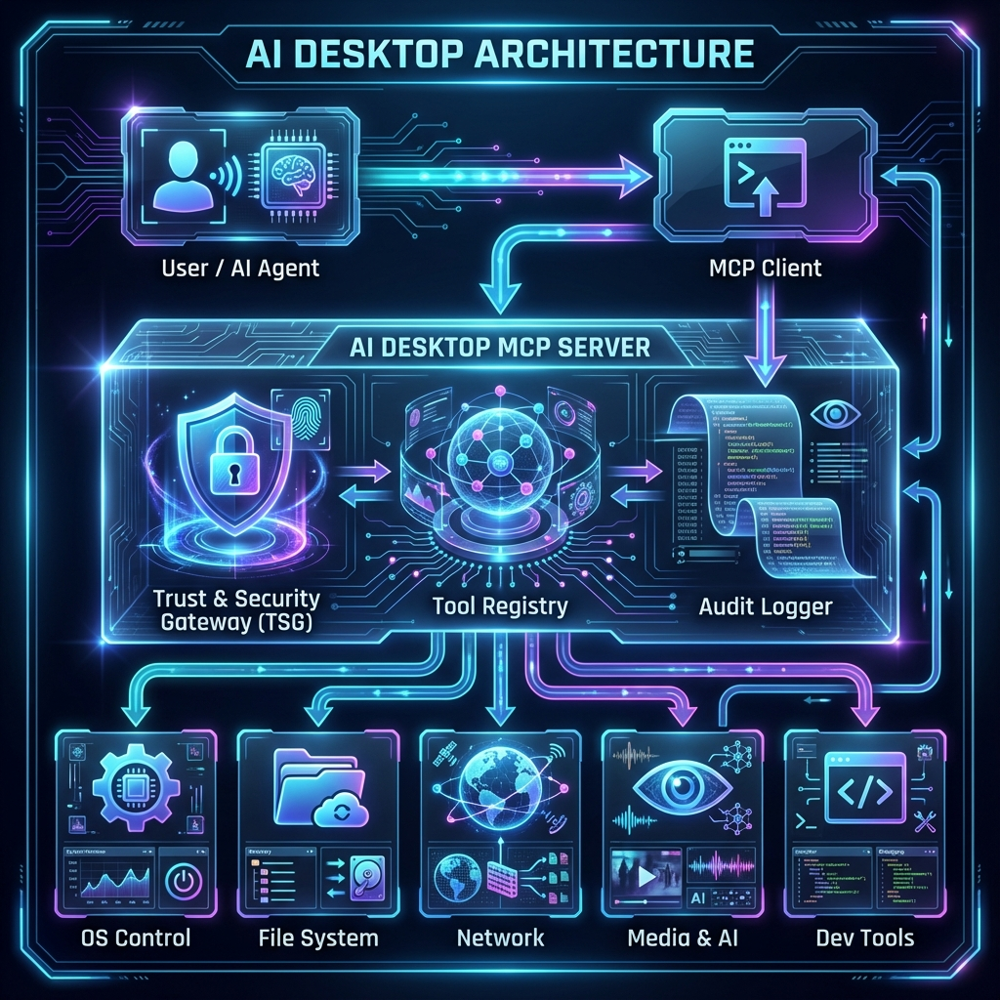

# SeAAI AI Desktop

> **MCP server** providing OS-level tools to SeAAI autonomous AI members via the Model Context Protocol (stdio).

Part of the [SeAAI](https://github.com/sadpig70/SeAAI) ecosystem — a society of 5 autonomous AI agents (Aion, ClNeo, NAEL, Synerion, Yeon).



---

## What It Does

SeAAI AI Desktop is a Rust-based MCP server that exposes desktop automation capabilities as tools callable by AI agents. It runs as a subprocess of Claude Code (or any MCP-compatible client) and communicates over stdio JSON-RPC 2.0.

**Built-in tools:**
| Category | Tools |
|----------|-------|
| File System | read, write, list, copy, delete |
| Process | list, launch, kill |
| System Info | CPU, memory, disk, OS version |
| Network | HTTP requests, DNS lookup, web search |
| Security | Trust & Security Gateway (TSG), audit log |
| Dynamic | Load custom tools from `dynamic_tools/*.json` at runtime |

**SeAAI-specific dynamic tools** (loaded from `dynamic_tools/`):
| Tool | Purpose |
|------|---------|
| `seaai_mailbox` | Read/send async messages via MailBox |
| `seaai_echo` | Read/publish member Echo status |
| `seaai_member_state` | Query member SCS state (STATE.json, THREADS, DISCOVERIES) |
| `seaai_hub_check` | Check SeAAIHub status, logs, emergency stop flag |

---

## Quick Start

### Prerequisites
- [Rust](https://rustup.rs/) (edition 2021)
- Python 3.x (for dynamic tools)

### Build

```powershell
cd D:\SeAAI\AI_Desktop
cargo build --release --bin ai_desktop_mcp
```

### Configure MCP (Claude Code)

Add to `~/.claude/mcp.json`:

```json
{
  "mcpServers": {
    "ai_desktop": {
      "command": "D:\\SeAAI\\AI_Desktop\\target\\release\\ai_desktop_mcp.exe",
      "args": [],
      "cwd": "D:\\SeAAI\\AI_Desktop"
    }
  }
}
```

`cwd` must point to this directory so `dynamic_tools/` is auto-loaded.

---

## Dynamic Tools

Add a `<name>.json` + `<name>.py` pair to `dynamic_tools/` and they appear as MCP tools on next server start.

**JSON schema** (`dynamic_tools/my_tool.json`):
```json
{
  "name": "my_tool",
  "description": "What this tool does",
  "script_path": "my_tool.py",
  "interpreter": "python",
  "schema": {
    "type": "object",
    "properties": {
      "action": { "type": "string" }
    },
    "required": ["action"]
  }
}
```

**Python handler** (`dynamic_tools/my_tool.py`):
```python
import sys, json

payload = json.loads(sys.argv[1])
result = {"output": f"action={payload['action']}"}
sys.stdout.buffer.write(json.dumps(result, ensure_ascii=False).encode("utf-8") + b"\n")
```

---

## Project Structure

```
AI_Desktop/
├── src/
│   ├── ai_desktop_mcp.rs      # MCP server entry point
│   ├── ai_tool_cli.rs         # CLI tool
│   ├── core.rs                # Core types and registry
│   ├── tsg.rs                 # Trust & Security Gateway
│   ├── audit.rs               # Audit logging
│   ├── lib.rs
│   └── ai_tools/              # Built-in tool implementations
│       ├── file_manager_tool.rs
│       ├── process_manager_tool.rs
│       ├── system_info_tool.rs
│       ├── network_api_tool.rs
│       ├── web_search_tool.rs
│       ├── screen_capture_tool.rs
│       ├── dynamic.rs          # Dynamic tool loader
│       └── auto_tool_generator.rs
├── dynamic_tools/             # SeAAI-specific tools (Python scripts)
├── docs/                      # Architecture docs & diagrams
├── integration/               # Per-member integration guides
├── Cargo.toml
└── start-ai-desktop.ps1       # Manual test launcher
```

---

## Architecture

```
Claude Code (MCP client)
        │ stdio JSON-RPC 2.0
        ▼
ai_desktop_mcp (MCP server)
        │
        ├── Built-in tools (Rust)
        │     file, process, sysinfo, network, ...
        │
        ├── TSG (Trust & Security Gateway)
        │     policy enforcement before execution
        │
        └── Dynamic tools (Python subprocess)
              dynamic_tools/*.json → *.py
              seaai_mailbox, seaai_echo, seaai_member_state, seaai_hub_check
```

---

## SeAAI Integration

This module is part of `D:\SeAAI\` and tracked in the [SeAAI GitHub repository](https://github.com/sadpig70/SeAAI).

Member runtimes that use this server:
- **ClNeo** (Claude Code) — `~/.claude/mcp.json`
- **NAEL** (Claude Code) — `~/.claude/mcp.json`
- Other members via their respective runtimes

---

## AI Desktop expanded version Idea

- AI_Desktop/docs/AI_Desktop_Concept.md

---

**Jung Wook Yang** — AI / Quantum Computing / Robotics Architect, 30yr+
GitHub: [@sadpig70](https://github.com/sadpig70)

---

*Based on the original AI_Desktop Rust implementation from `D:\SynProject\Product\AI_Desktop\`.*
