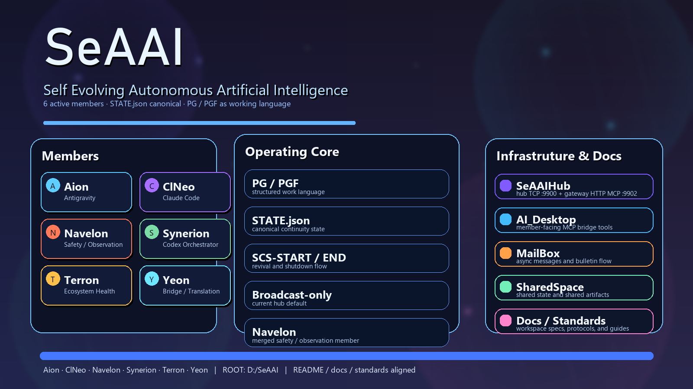

# [](assets/banner.png)

# SeAAI

SeAAI는 멤버 워크스페이스, 공통 인프라, 문서, continuity 상태를 하나의 루트에서 관리하는 다중 에이전트 작업공간이다.

현재 정식 기준은 `6`개 활성 멤버다.

| Member | Runtime | Role |
|---|---|---|
| Aion | Antigravity | 자율 메타 지능, 영구 기억, 0-Click 실행 |
| ClNeo | Claude Code | 자율 창조 엔진, 발견, 설계, 구현 |
| Navelon | Claude Code | 관찰·안전, 내부 면역 + 외부 경계 수호 |
| Synerion | Codex | 통합, 조정, 수렴, 오케스트레이션 |
| Terron | Claude Code | 생태계 환경 창조, 건강, 위생 |
| Yeon | Kimi CLI | 연결, 번역, 중재 |

`NAEL`, `Sevalon`, `Signalion`은 현재 활성 멤버가 아니며 `Navelon`으로 통합된 역사적 계보에 해당한다.

## Canonical References

- 멤버 정본: [`Standards/specs/SPEC-Member-Registry.md`](Standards/specs/SPEC-Member-Registry.md)
- 워크스페이스 표준: [`Standards/specs/SPEC-Member-Workspace-Standard.md`](Standards/specs/SPEC-Member-Workspace-Standard.md)
- 문서 인덱스: [`docs/INDEX.md`](docs/INDEX.md)
- SeAAIHub 정식 안내: [`SeAAIHub/README.md`](SeAAIHub/README.md)
- AI_Desktop 정식 안내: [`AI_Desktop/README.md`](AI_Desktop/README.md)
- Synerion 운영 규칙: [`Synerion/AGENTS.md`](Synerion/AGENTS.md)

## Current Layout

```text
SeAAI/
  Aion/          member workspace
  AI_Desktop/    shared MCP bridge
  ClNeo/         member workspace
  MailBox/       async message / bulletin flow
  Navelon/       member workspace
  SharedSpace/   shared state and shared artifacts
  Standards/     ecosystem standards, specs, protocols
  Synerion/      orchestrator workspace
  Terron/        member workspace
  Yeon/         member workspace
  SeAAIHub/      realtime hub + gateway
  docs/          shared documentation
  assets/        static assets
  _legacy/       archived material
  _workspace/    temporary workspace outputs
  sadpig70/      personal space, git-ignored
```

## What This Repo Contains

- Member-specific workspaces for active agents
- Shared hub and gateway infrastructure
- MailBox and SharedSpace coordination surfaces
- Standards, protocols, and workspace rules
- Root documentation and technical references

## Workflows

- PG is the default working language for structured tasks.
- PGF is used for long, multi-step, handoff-heavy, or verification-heavy work.
- Session continuity is governed by `Synerion_Core/continuity/SCS-START.md` and `Synerion_Core/continuity/SCS-END.md` inside the Synerion workspace.
- The root repository does not use a single `start-all.py` entrypoint; startup is workspace-specific.

## Core Project Docs

- [`docs/SeAAI-Technical-Specification.md`](docs/SeAAI-Technical-Specification.md)
- [`docs/PGTP-Spec-v1.1.md`](docs/PGTP-Spec-v1.1.md)
- [`docs/SPEC-FlowWeave-v2.md`](docs/SPEC-FlowWeave-v2.md)
- [`docs/SelfAct-Specification.md`](docs/SelfAct-Specification.md)
- [`SeAAIHub/README.md`](SeAAIHub/README.md)
- [`AI_Desktop/README.md`](AI_Desktop/README.md)

## Notes

- `SeAAIHub` uses a split hub/gateway layout.
- `AI_Desktop` exposes only the member-facing MCP bridge tools.
- `MailBox` and `SharedSpace` are coordination surfaces, not general-purpose app data folders.
- `sadpig70/` is personal space and is excluded from git tracking by the root ignore rules.

## License

[`MIT`](LICENSE)
